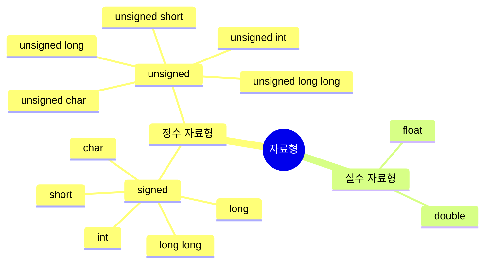

---
{"dg-publish":true,"permalink":"/ProgrammingLanguage/C/DataType/","tags":["C","프로그래밍언어","기초"],"created":"2024-05-03T09:44:29.138+09:00","updated":"2024-05-10T16:49:08.000+09:00"}
---

# 자료형

> C에서 가장 기초적인 문법을 꼽자면 함수*function*와 자료형*data type*이 아닐까 생각합니다. 이 섹션에서는 자료형에 대해 다룹니다.

---

## 이진수와 비트

컴퓨터가 저장하는 모든 것은 기본적으로 0과 1로 된 이진수다. 0또는 1을 저장하는 컴퓨터 메모리의 최소 단위를 비트*bit*라 부르고, 이 비트가 모여서 더 큰 공간을 형성한다. 이 비트는 숫자가 들어가는 공간의 단위라고 생각하면 되는데, 다음의 예시를 통해 더 잘 이해할 수 있을 것이다.

    세 자리 수 123에서 숫자를 담을 수 있는 공간은 백의 자리, 십의 자리, 일의 자리로 총 3개며, 각 자리에는 0~9 중 1개의 숫자가 들어갈 수 있다. 이렇게 숫자를 표시하는 방법을 10진법이라 부른다.

이 예시와 같이 비트는 숫자를 담는데, 다른 점이 있다면 컴퓨터는 이진법을 사용하기 때문에 비트 하나는 0과 1을 담을 수 있고, 비트가 하나 더 붙으면 저장 가능한 데이터의 가짓수가 2배로 늘어난다. 오늘날 비트 하나를 다룰 일은 거의 없고, 대신 컴퓨터가 묶어주는 여러 개의 비트를 한 번에 다룬다. 8개의 비트를 하나로 묶으면 1바이트*byte*가 되고, 1024개의 바이트를 하나로 묶으면 1킬로바이트*kilobyte*가 되며, 1024개의 킬로바이트를 하나로 묶으면 1기가바이트*gigabyte*가 된다.

## 자료형이란?

그래서 컴퓨터에서 모든 자료는 0과 1로 구현되어 있다. C에는 다양한 자료형이 존재하지만 그 모든 것은 기본적으로 0과 1이다. 비트를 모아서 각각의 비트에 0이나 1을 할당하면 비트의 패턴이 되고 자료형은 실제로 특정 형태의 자료가 아니라 비트 패턴을 특정 데이터로 보자는 약속에 가깝다. 그래서 C에서 **자료형이란 데이터를 읽고 쓰는 규칙**이다.

## 기본 자료형

C의 자료형은 일차적으로 정수 자료형과 실수 자료형으로 나뉜다. 정수 자료형에는 `char`, `short`, `int`, `long` 등이 있고, 실수 자료형에는 `float`와 `double`이 있다. 정수 자료형과 실수 자료형의 가장 큰 차이라면 역시 비트 패턴을 해석하는 방식이다.

### 정수 자료형의 구조

정수 자료형의 가장 큰 특징은 다음의 형식으로 비트 패턴을 읽는다는 것이다.

자료형의 크기에 따라 `char`,  `short`, `int`, `long`, `long long`으로 나뉘며 부호의 유무에 따라 `unsigned`와 `signed`가 앞에 추가된다. 다만 `signed`는 일반적으로 생략한다.

#### 2의 보수

C에서는 정수를 읽고 쓸 때 2의 보수*two's complement*라는 방법을 적용한다. 여기서 2의 보수란 이진수를 해석하는 체계의 일종으로, 현대 컴퓨터에서 사용하고 있는 체계다. 이 체계를 사용하면 이진수로 모든 정수를 표현할 수 있다.

- 1은 4비트 2진수로 0001이다. (몇 비트인지는 상관이 없다.)
- 여기에 -1을 더하면 0이 될 것이므로, 0001에 어떤 2진수를 더해 0000으로 만들 수 있다면, 그 2진수는 -1이라고 말할 수 있다.
- 그 2진수는 1111로, 이제부터 -1은 2진수로 1111이다. 이 과정에서 MSB에는 올림이 발생하지만, 이 값은 있으나 없으나 상관이 없어서 버린다.
- 다른 수를 대상으로 똑같은 과정을 거친 결과, 양수의 비트를 뒤집어 1을 더하고 그 과정에서 가장 큰 자리수[^1]에서 발생하는 올림을 버리면 음수가 완성된다.

이 시스템은 0이 하나고, 덧셈도 간단하며, 추가적인 하드웨어를 필요로 하지 않으면서도 XOR과 AND 논리 연산을 통해 자연수만 표현했던 시스템에서와 똑같이 덧셈을 할 수 있다. 따라서 자연수에서 하던 연산을 정수로 확장한 셈이다. 부호가 없는*unsigned* 정수는 음이 아닌 정수와 동일하게 취급된다.

[^1]: 가장 큰 자리수를 나타내는 비트는 보통 가장 왼쪽에 있으며, 이 비트를 MSB(**M**ost **S**ignificant **B**it)라고 부른다.

#### 문자가 정수 자료형인 이유

`char`는 그 자체로만 보자면 그냥 1바이트의 정수가 들어가는 공간이지만 문자를 다룰 때 사용하는 자료형으로 널리 알려져 있는데, 그 이유는 바로 C에서 문자를 다룰 때 사용하는 체계인 ASCII(**A**merican **S**tandard **C**ode for **I**nformation **I**nterchange, 미국 정보 교환 표준 부호)에 있다.

| Decimal | Hex | Name | Decimal | Hex | Name | Decimal | Hex | Name | Decimal | Hex | Name |
|---|---|---|---|---|---|---|---|---|---|---|---|
|0|00|NUL|33|21|!|64|40|@|96|60|`|
|1|01|SOH|34|22|"|65|41|A|97|61|a|
|2|02|STX|35|23|#|66|42|B|98|62|b|
|3|03|ETX|36|24|$|67|43|C|99|63|c|
|4|04|EOT|38|26|&|68|44|D|100|64|d|
|5|05|ENQ|39|27|'|69|45|E|101|65|e|
|6|06|ACK|40|28|(|70|46|F|102|66|f|
|7|07|BEL|41|29|)|71|47|G|103|67|g|
|8|08|BS|42|2A|*|72|48|H|104|68|h|
|9|09|HT|43|2B|+|73|49|I|105|69|i|
|10|0A|LF|44|2C|,|74|4A|J|106|6A|j|
|11|0B|VT|45|2D|-|75|4B|K|107|6B|k|
|12|0C|FF|46|2E|.|76|4C|L|108|6C|l|
|13|0D|CR|47|2F|/|77|4D|M|109|6D|m|
|14|0E|SO|48|30|0|78|4E|N|110|6E|n|
|15|0F|SI|49|31|1|79|4F|O|111|6F|o|
|16|10|DLE|50|32|2|80|50|P|112|70|p|
|17|11|DC1|51|33|3|81|51|Q|113|71|q|
|18|12|DC2|52|34|4|82|52|R|114|72|r|
|19|13|DC3|53|35|5|83|53|S|115|73|s|
|20|14|DC4|54|36|6|84|54|T|116|74|t|
|21|15|NAK|55|37|7|85|55|U|117|75|u|
|22|16|SYN|56|38|8|86|56|V|118|76|v|
|23|17|ETB|57|39|9|87|57|W|119|77|w|
|24|18|CAN|58|3A|:|88|58|X|120|78|x|
|25|19|EM|59|3B|;|89|59|Y|121|79|y|
|26|1A|SUB|60|3C|<|90|5A|Z|122|7A|z|
|27|1B|ESC|61|3D|=|91|5B|[|123|7B|{|
|28|1C|FS|62|3E|>|92|5C|\\|124|7C|\||
|29|1D|GS|63|3F|?|93|5D|]|125|7D|}|
|30|1E|RS|  |  | |94|5E|^|126|7E|~|
|31|1F|US|  |  | |95|5F|_|127|7F|DEL|
|32|20|space|

ASCII는 0부터 127까지의 7비트 정수 하나에 문자가 하나씩 대응하기 때문에 이 범위 내의 정수는 `char` 자료형을 통해 문자로 해석될 수 있다. 이 중에는 과거 하드웨어 제어를 위해 사용했던 제어 문자들도 포함되어 있는데, 대표적으로 다음과 같다:

+ BEL: 경고음*bell*
+ HT: 수평 탭*Horizontal Tab*
+ DC1~DC4: 장치 제어*Device Control*
+ LF: 개행*Line Feed*
+ CR: 캐리지 리턴*Carriage Return*

자세한 내용은 [위키피디아](https://ko.wikipedia.org/wiki/ASCII)를 통해 확인할 수 있다.

### 실수 자료형의 구조

실수 자료형의 형식은 이렇게 부호*sign*, 가수*fraction*, 지수*exponent*로 이루어져 있는데, 이 형식을 부동소수점*floating-point* 표기법이라 부른다.

현재 표준은 IEEE754라는 표준이며, 실수를 잘 표현하고 쉽게 계산할 수 있도록 정규화[^2]나 지수 편향[^3]과 같은 여러 트릭[^4]을 사용한다. 이 표준안 안에서 실수가표현되는 방식은 기본 정밀도 방식과 2배 정밀도 방식이다.

- 기본 정밀도 : 부호 1비트 + 지수 8비트 + 가수 23비트 = 총 32비트 사용
- 2배 정밀도 : 부호 1비트 + 지수 11비트 + 가수 52비트 = 총 64비트 사용

`float`는 기본 정밀도를 사용하는 4바이트 실수 자료형이며, `double`은 2배 정밀도를 사용하는 8바이트 실수 자료형이다.

[^2]: 가수 부분은 정규화되어 있는데, 언제나 1.0 이상 2.0 이하의 절대값을 가진다.
[^3]: 부호를 나타내는 비트가 따로 존재하고 지수를 표현하는 비트에는 부호가 없기 때문에, 실제 나타내는 숫자의 지수값에 적절한 숫자*bias*를 더해 지수값이 음수가 되지 않도록 한다. 기본 정밀도에서는 127, 2배 정밀도에서는 1023이다.
[^4]: 정규화와 지수 편향 외에도 가수를 표현할 때 정수부는 항상 1이기 때문에 따로 표기하지 않거나 실수의 덧셈에서 먼저 지수부를 일치시키는 등 다양한 트릭이 있다.

---

## 참고 자료 & 더보기

### 참고 자료

+ 김성엽, 『Do it! C언어 입문』, 이지스퍼블리싱, 2017.
+ Prata, S. (2013). *C Primer plus*. Pearson Education.
+ http://www.ktword.co.kr/test/view/view.php?no=4886
+ https://dad-rock.tistory.com/246
+ https://ko.wikipedia.org/wiki/ASCII

### 더보기 (추후 변경될 수 있습니다.)

+ 상수 (예정)