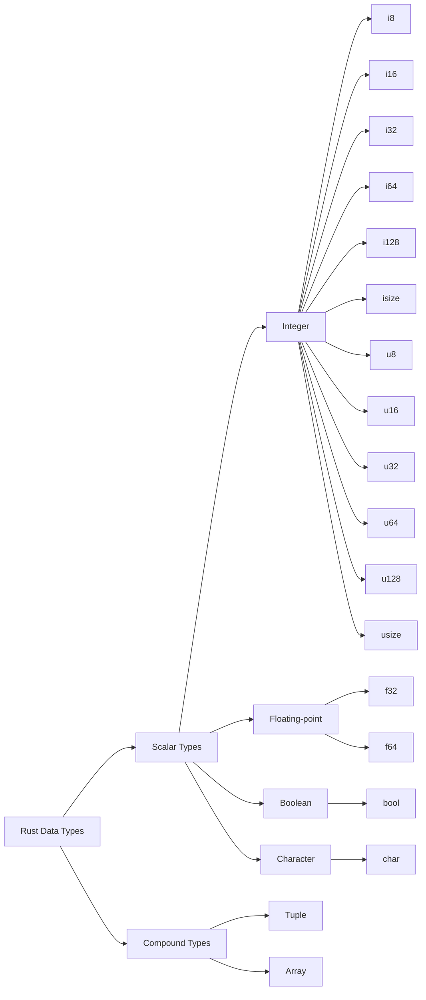

---
{"dg-publish":true,"tags":["Rust","프로그래밍언어"],"permalink":"/ProgrammingLanguage/Rust/Data_Type/","dgPassFrontmatter":true,"created":"2024-06-17T10:34:47.323+09:00","updated":"2024-07-22T23:27:27.640+09:00"}
---


# 러스트의 자료형

> 러스트에도 다른 언어처럼 자료형이 있지만, 코드에 적어야 하는 상황은 생각보다 많지 않습니다. 덕분에 코드 자체는 쓰기 쉬워졌지만, 그만큼 자료형에 대한 공부에 소홀해지기 쉽습니다. 이번 글에서는 러스트의 자료형에 대한 기초적인 지식을 다룹니다.

---

## `let` : 러스트는 자료형을 알아서 인식한다?

일반적인 컴퓨터 언어가 그렇듯, 러스트의 모든 값은 특정한 타입*type*을 가진다. 기본으로 제공되는 타입일 수도 있고, 기본으로 제공되는 타입을 조합해서 만든 새로운 타입일 수도 있다. The Rust Programming Language를 기준으로 하면 모든 기본 타입은 크게 스칼라*scalar* 타입과 복합*compound* 타입으로 나눌 수 있고, 각 자료형에 해당하는 키워드도 엄연히 존재한다. 그런데 러스트에서는 어떤 변수의 타입을 명시할 필요가 없다.

```rust
let x = 2.0; // 무슨 타입?
```

컴파일 시점에 모든 변수의 타입이 정해져 있어야 하는 정적 타입의*statically typed* 언어임에도 불구하고 타입 추론*type inference*을 지원하는 러스트의 컴파일러 덕분에, 러스트에서 모든 변수는 이름과 변수를 가리키는 키워드 `let` 만으로도 충분히 선언할 수 있다 . 나머지는 컴파일러가 코드를 읽고 알아서 판단해 자동으로 변수의 타입을 정해준다.

다행히 `rust-analyzer`처럼 각각의 변수가 어떤 타입을 가지게 되는지 표시해주는 프로그램들이 많기 때문에, 컴파일러가 자동으로 배정해주는 타입을 우리가 알아서 추론해야 한다거나 그럴 일은 없다. 회색으로 나타나는 코드는 실제 코드가 아니다.


### 수동으로 자료형 지정하기

그럼에도 불구하고, 일반적인 상황에서 `let`만 사용하고 타입을 따로 선언하지 않는 것과 같은 이유로 컴파일 이전에 코드에서 변수의 타입이 결정되지 않는 상황이라면 그땐 타입을 반드시 명시해야 한다. 타입을 명시할 땐 변수 이름 바로 뒤에 아래 예시처럼 변수의 타입을 추가하면 된다.

```rust
let x: f64 = 2.0 // f64 타입.
```

## `mut` : 불변 vs 가변

컴파일 시점에 모든 변수의 타입이 정해져야 한다는 러스트의 특징은 모든 변수가 기본적으로 불변*immutable*이라는 또 하나의 특징으로 이어진다. 변수가 불변이라는 것은 변수에 어떤 값이 할당되면 그 값은 바꿀 수 없다는 것을 의미한다. 실제로 예시와 같이 `let`으로 선언된 변수의 값을 바꾸려 한다면 어김없이 에러가 발생한다.

```rust
fn main() {
    let x = 5;
    println!("The value of x is: {x}");
	
	//변수는 한 번 선언되면 값을 바꿀 수 없다.
    x = 6;
    println!("The value of x is: {x}");
}
```

러스트에서 변수의 값을 변경하기 위해서는 `mut`라는 키워드가 필요한데, `let`과 함께 쓰여 기본적으로 한번 할당된 값을 바꿀 수 없는 변수를 할당된 값을 바꿀 수 있는 변수로 바꾸어 준다. 단, 이것만으로는 변수의 타입을 바꿀 수 없다.

### 섀도잉

그런데 굳이 `mut`를 사용하지 않아도 새 변수를 기존의 변수와 같은 이름으로 선언할 수 있는데, 아래 코드를 통해 이런 일이 가능한 이유를 알 수 있다.

```rust
fn main() {

	// 첫번째 x
    let x = 5;

	// 두번째 x, 첫번째 x는 우변에 사용됨.
    let x = x + 1;
	
    {
	    // 세번째 x, 두번째 x는 우변에 사용됨.
        let x = x * 2;
        println!("The value of x in the inner scope is: {x}");
    }
	
    println!("The value of x is: {x}");
}
```

두번째 x를 선언할 때 우변에 사용되는 x는 첫번째 x인데, 이 과정이 끝나면 첫번째 x는 앞으로도 사용할 수 없다. 이때 첫번째 x가 두번째 x에 의해 가려졌다*shadowed*고 표현한다.

세번째 x는 중괄호`{}` 안에 선언되어 있고 이때 우변에 있는 x는 두번째 x다. 이때부터 중괄호로 감싸여진 구간의 끝까지 세번째 x를 제외한 나머지 x는 사용할 수 없고, 중괄호 이후부터는 다시 두번째 x를 사용하게 된다. 이때도 세번째 x가 두번째 x를 가리게 되는데, 선언된 곳이 중괄호 안이기 때문에 중괄호가 끝나면 섀도잉이 끝나고 다시 두번째 x가 드러난다.

섀도잉이란 이렇게 `let`을 사용해 기존 변수와 같은 이름을 가진 새 변수를 선언해 기존 변수를 가리는 것으로, 일부 상황에서는 변수의 값이나 타입을 바꾸는 것과 같은 효과를 줄 수 있다.

## 상수

상수*constant*는 항상 불변이다[^1]. `const` 키워드와 함께 선언하며, 변수와 달리 반드시 타입을 명시해야 한다. 그리고 무엇보다 컴파일 과정에서 연산이 끝나야 한다. 이 점을 제외하면 러스트의 상수는 다른 언어에서 사용하는 상수의 목적이나 기능과 동일하다. 프로그램에서 사용하는 어떤 고정된 값의 의미를 전달하는 것이 상수의 주된 기능이다.

```rust
const THREE_HOURS_IN_SECONDS: u32 = 60 * 60 * 3;
```

[^1]: 그러니 당연히 `mut`를 사용할 수 없다.

## 몇 가지 기본 자료형들

러스트에서 기본 타입이 되는 자료형들을 분류하면 아래와 같다. 하나의 값을 다루는 스칼라 타입과 여러 값을 하나의 타입으로 묶을 수 있는 복합 타입이 있으며, 기본적인 복합 타입에는 [튜플](https://doc.rust-lang.org/std/primitive.tuple.html)*tuple*과 [배열](https://doc.rust-lang.org/std/primitive.array.html)*array*가 있다.



### 정수형 타입

정수형*Integer*은 소수점이 없는 숫자로, 8비트부터 128비트까지 그 크기를 자유롭게 선택할 수 있다. `i`로 시작하는 타입은 부호가 있고, 부호가 없는 타입은`u`부터 시작한다. 또한 이 중 `isize`와 `usize`는 프로그램이 동작하는 컴퓨터의 아키텍처에 따라 크기가 달라진다. 64비트 아키텍처이면 64비트를, 32비트 아키텍처이면 32비트를 갖게 된다.

### 실수형 타입

부동 소수점*Floating-point* 숫자를 다루는 기본 타입은 `f32`와 `f64` 두 개로, 각각 32비트와 64비트의 크기를 가진다. 이 중 `f64`는 컴파일러가 부동 소수점 숫자를 담은 변수에 부여하는 기본 타입이며, [[ProgrammingLanguage/C/Data_Type#^eff12c\|2배 정밀도]]다. 반면 `f32`는 [[ProgrammingLanguage/C/Data_Type#^d427d3\|기본 정밀도]]다.

### 불리언 타입

불리언*Boolean* 타입은 `bool`로 명시되며 `true`와 `false` 두 값을 가질 수 있고, 크기는 1바이트로 고정이다.

### 문자 타입

러스트에서 가장 기본적인 문자 타입은 `char`다. 다른 언어의 `char` 타입과 다른 점이 몇 가지 있어 주의해야 한다.

```rust
fn main() {
    let c = 'z';
    let z: char = 'ℤ'; // 명시적인 타입 어노테이션
    let heart_eyed_cat = '😻';
}
```

러스트의 `char` 타입은 4바이트의 크기를 가지며 유니코드*Unicode* 스칼라 값[^2]을 표현한다. 그래서 러스트의 `char` 타입 변수에는 부호가 있는 문자나 한글/한자/가나 등 다른 언어의 `char` 타입에서는 다루기 어려웠던 문자들을 다룰 수 있지만, 그런 만큼 [[DS&Algorithm/String\|기존 언어와는 다른 방식으로 문자나 문자열에 접근해야 한다.]]

[^2]: 유니코드 스칼라 값의 범위는 `U+0000`~`U+D7FF`, `U+E000`~`U+10FFFF`이다.

## 러스트에는 널(Null)이 없다

자료형과 관련된 러스트의 독특한 특징 중 하나는 널*null*이 없다는 것이다. 널은 여러 컴퓨터 언어에서 사용하고 있는 개념 중 하나로, "값이 없음"을 나타내기 위한 값이다. 이런 널 개념이 존재하는 언어에서 변수의 상태는 널이거나 널이 아니다.

```CPP
//C++
int *ptr = nullptr;
```

널 개념이 있으면 값이 없는 상태를 구현하기 쉽지만, 널 값을 널이 아닌 값처럼 사용하려고 할 때나 그 반대 상황에 생기는 여러 종류의 에러에 대처해야 한다. 러스트에도 [[ProgrammingLanguage/Rust/Error_Handling\|값의 유무를 표현할 수 있는 방법은 있지만]], C++의 `NULL` 혹은 `nullptr`이나 Java의 `null`처럼 널 개념을 직접적으로 나타내는 키워드는 없다.

---

## 참고 자료 & 더보기

+ [The Rust Programming Language(한국어판), 3. 일반적인 프로그래밍 개념](https://doc.rust-kr.org/ch03-00-common-programming-concepts.html)
+ [The Rust Programming Language(한국어판), 6.1. 열거형 정의하기](https://doc.rust-kr.org/ch06-01-defining-an-enum.html#option-열거형이-널-값보다-좋은-점들)
+ [tuple - Rust](https://doc.rust-lang.org/std/primitive.tuple.html)
+ [array - Rust](https://doc.rust-lang.org/std/primitive.array.html)