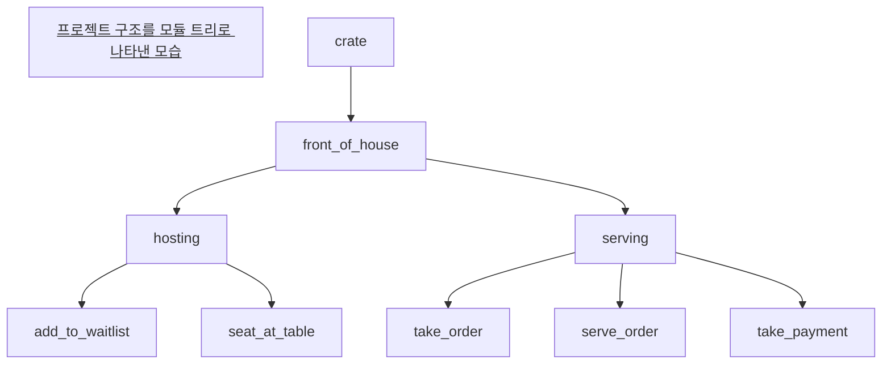
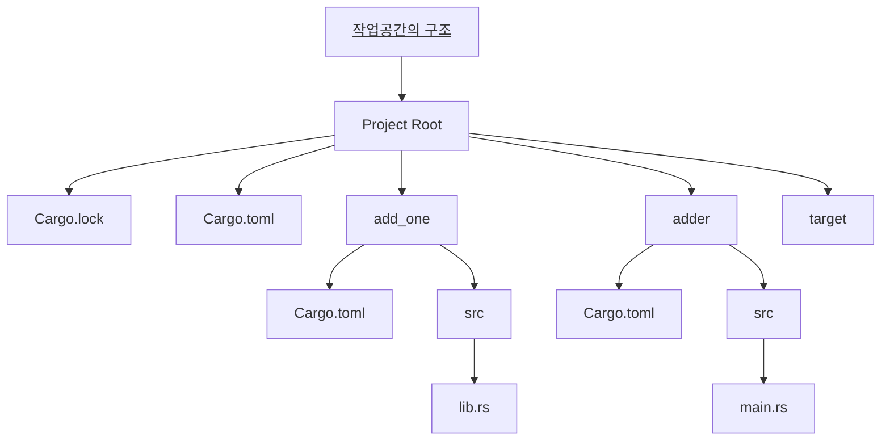

---
{"dg-publish":true,"permalink":"/programming-language/rust/project-analysis/","tags":["Rust","프로그래밍언어"],"created":"2024-07-10T17:04:49.387+09:00","updated":"2024-07-22T23:26:05.698+09:00"}
---


# 패키지, 크레이트, 모듈, 작업공간

> 크레이트*crate*는 러스트가 컴파일 한 차례에 고려하는 가장 작은 코드 단위입니다. 만약 C나 C++를 미리 공부했다면, 크레이트가 목적 파일*Object file*과 유사한 개념이라는 것을 쉽게 알 수 있을 것입니다. 크레이트는 한 개 이상의 모듈*module*을 포함할 수 있고, 패키지*package*는 여러 개의 크레이트가 모여 만들어집니다. 이번 글에서는 러스트로 이루어진 프로젝트의 기본 골격과 프로젝트를 구성하는 요소인 크레이트, 모듈, 패키지, 그리고 작업공간*workspace*에 대해 알아봅니다.

---

## 크레이트

크레이트는 러스트의 프로그램이 될 수 있는 가장 단순한 단위다. 굳이 [[ProgrammingLanguage/Rust/Env_Setting#^24d4cc\|카고]]가 없더라도, 하나의 소스 파일로 구성된 프로그램 또한 하나의 크레이트다. C나 C++에서 단일 소스 파일로 프로그램을 만들 수 있는 것과 동일하다. 마찬가지로, C나 C++의 실행 파일이나 라이브러리처럼 크레이트도 실행 가능한 크레이트와 라이브러리로 활용되는 크레이트가 있으며, 컴파일 과정 또한 유사하다.

### 바이너리 크레이트

실행 가능한 실행파일로 컴파일할 수 있는 프로그램을 바이너리 크레이트*binary crate*라 부른다. 바이너리 크레이트는 러스트 프로그램의 시작점이자 실행 흐름을 정의한 `main`함수를 포함하고 있어야 한다. 바이너리 크레이트를 만드는 방법은 아주 간단한데, 커맨드 라인에서 `cargo new` 뒤에 만들고 싶은 패키지의 이름을 입력하면 패키지와 함께 패키지의 이름과 동일한 바이너리 크레이트가 그 안에 만들어진다.

```bash
revenantonthemission@MacBook-Pro-3 rustprojects % cargo new binary_crate
    Creating binary (application) `binary_crate` package
note: see more `Cargo.toml` keys and their definitions at https://doc.rust-lang.org/cargo/reference/manifest.html
```

### 라이브러리 크레이트

`main`함수가 없고 실행파일로 컴파일되지 않는 크레이트를 라이브러리 크레이트*library crate*라 부른다. 라이브러리 크레이트는 실행할 수 없는 대신 여러 프로젝트에서 사용할 수 있는 기능이 정의되어 있으며, 일반적으로 '크레이트'라 부르는 것은 바로 이쪽이다. 라이브러리 크레이트를 만들기 위해서는 커맨드 라인에서 `cargo new --lib` 뒤에 원하는 이름을 입력하면 된다.

```bash
revenantonthemission@MacBook-Pro-3 rustprojects % cargo new --lib restaurant     
    Creating library `restaurant` package
note: see more `Cargo.toml` keys and their definitions at https://doc.rust-lang.org/cargo/reference/manifest.html
```

## 모듈

한편, 모든 크레이트에는 크레이트 루트*crate root*라는 것이 있는데, 러스트 컴파일러가 컴파일을 시작하는 곳이다. 일반적으로 바이너리 크레이트에서는 `src/main.rs`, 라이브러리 크레이트에서는 `src/lib.rs`가 크레이트 루트에 해당한다. 러스트에서 모듈*module*은 코드의 구조를 일목요연하게 드러내기 위한 구성 요소로, 크레이트 루트에 선언되어 있어야 한다. 이때 사용하는 것이 바로 `mod`라는 키워드다.

```rust
mod front_of_house;
```

`mod`를 사용해 위와 같이 모듈을 선언할 수 있으며, 컴파일러는 이 모듈의 코드를 확인하기 위해 기본적으로 세 장소를 확인한다:
+ `{}`를 이용해 선언과 함께 정의된 경우, 현재 파일에서 찾는다.
+ `src` 폴더 내에 모듈 이름으로 된 소스 파일에서 찾는다. 위의 경우 `src/front_of_house.rs`에 모듈이 정의되어 있어야 컴파일러가 찾을 수 있다.
+ `src/모듈 이름/mod.rs` 라는 소스 파일에서 찾는다. 이 방법은 디렉토리를 통해 모듈과 크레이트의 관계를 보여주기에는 좋지만, 프로젝트가 커질 경우 관리하기 어렵다.

한편 크레이트 루트가 아닌 다른 파일에서는 서브모듈*submodule*을 선언할 수 있다. 크레이트 루트가 아닌 다른 파일에 선언한다는 점을 제외하면 모듈과 동일하다. 똑같이 `mod`로 선언하고, 부모 모듈의 이름으로 된 폴더 안쪽에서 컴파일러가 코드를 찾는 상대 경로 또한 동일하다. 서브 모듈의 이름으로 된 소스 파일에서 찾거나 서브 모듈의 이름으로 된 하위 경로에서 찾는다.

### 모듈 트리

특정 장소, 특정 시간 등 연관성이 있는 사진들을 분류해 폴더로 묶으면 필요한 사진을 더 잘 찾을 수 있는 것처럼, 모듈을 사용하면 필요한 코드가 어디에 있는지 어렵지 않게 파악할 수 있다. 이처럼 모듈은 파일 시스템의 폴더와 같은 기능을 수행하는데, 덕분에 모듈을 트리 구조로 엮으면 모듈이 서로 어떻게 중첩되어 있는지 파악할 수 있는데, 이 구조를 모듈 트리*module tree*라고 부른다. 



위와 같이 모든 모듈 트리의 최상위에는 `crate`라는 모듈이 암묵적으로 위치한다. 다른 모듈처럼 명시적으로 선언하지는 않지만, 모든 모듈을 아우르는 이름이다. 그보다 아래에 있는 모듈이 소스 코드에 `mod`로 선언되어 있는 모듈이다. 일반적인 트리와 같이 상위 노드가 동일한 노드들, 즉 동일한 모듈 내에 있는 모듈들은 형제*sibling* 관계에 있으며, 부모 모듈 안에 자식 모듈이 있다. 여기서 크레이트 루트가 무엇인지 조금 더 선명하게 볼 수 있게 되는데, src/main.rs나 src/lib.rs에 있는 모든 코드가 `crate`에 속하기 때문에 두 파일을 크레이트 루트라고 부르는 것이다.

### 절대 경로와 상대 경로

다른 모듈의 코드를 사용하기 위해서는 파일처럼 경로를 사용해 모듈 트리에서 해당 모듈이나 함수의 위치를 특정하여 연결해줘야 한다. 이 경로에는 절대 경로와 상대 경로가 있는데, 각각 다음과 같다:

+ 절대 경로*absolute path*는 크레이트 루트를 출발점으로 삼는 경로다. 외부 크레이트에서 가져오는 코드의 경로는 해당 크레이트 이름으로 시작하고 현재 위치한 크레이트에 존재하는 코드의 경로는 `crate`부터 시작한다.
	```rust
	// 절대 경로
	crate::front_of_house::hosting::add_to_waitlist();
	
	// 상대 경로, 현재 위치는 crate
	front_of_house::hosting::add_to_waitlist();
	```
+ 상대 경로*relative path* 는 현재의 모듈을 출발점으로 삼는 경로다. `super`를 사용해 현재 모듈의 부모 모듈을 가리킬 수 있고, 이를 통해 현재 모듈의 부모 모듈에서 시작하는 상대 경로를 작성할 수 있다.

파일 경로에서 `/`를 사용하는 것처럼, 모듈의 경로를 사용할 때는 `::`를 사용한다.

### `use` : 경로 단축하기

그런데 다른 모듈에 있는 함수를 사용할 때마다 매번 경로를 입력하는 것은 매우 번거롭다. 이럴 때 사용하는 것이 바로 `use`다. `use`를 사용하면 어떤 경로의 단축경로를 만들 수 있고, 그렇게 짧아진 경로를 `use`가 유효한 범위 안 어디서든 사용할 수 있다.

```rust
// src/lib.rs (크레이트 루트)
mod front_of_house {
    pub mod hosting {
        pub fn add_to_waitlist() {}
    }
}

// 이제 crate::front_of_house::hosting 대신 hosting만 써도 된다.
use crate::front_of_house::hosting;

pub fn eat_at_restaurant() {
    hosting::add_to_waitlist();
}
```

한편 `use`를 사용해 이름을 가져올 경우, 모듈은 다르나 이름이 겹치는 경우가 발생할 수 있다. 일반적으로 `use`를 사용해 다른 모듈 안에 있는 함수를 가져올 때는 부모 모듈까지만 단축해서 사용하고, 열거형이나 구조체처럼 자료형을 가져오는 경우 전체 경로를 자료형 이름으로 단축해서 사용한다.

```rust
use std::collections::HashMap;

fn main() {
    let mut map = HashMap::new();
    map.insert(1, 2);
}
```

이 과정에서 경로는 다르지만 이름이 같은 아이템[^1]이 모두 필요한 상황이 발생할 수 있는데, 두 `use` 구문이 모두 유효한 범위가 발생하게 되면 중복이 발생하는 상황에 해당하는 아이템들은 사용할 수 없게 된다. 이 문제를 해소하는 방법은 크게 두 가지다.

[^1]: 함수, 구조체, 열거형, 상수 등 러스트에서 프로그램의 구조를 이루는 기본적인 요소를 아이템*Item*이라 부른다.

#### 더욱 느슨한 경로 단축

앞서 열거형이나 구조체를 가져올 때는 `use`를 통해 이름 전체를 자료형의 이름으로 단축하는 것이 일반적이라고 했는데, 일반적인 모든 것이 그렇듯이 이럴 때는 예외를 허용할 필요가 있다.

```rust
use std::fmt;
use std::io;

fn function1() -> fmt::Result {
    // --생략--
}

fn function2() -> io::Result<()> {
    // --생략--
}

```

동일한 이름을 가진 아이템을 사용할 때는 부모 모듈까지 명시해서 사용하도록 `use`를 통한 경로 단축을 조절하면, 코드의 가독성을 높일 수 있고 오류도 해결할 수 있다.

#### `as` : 다른 이름으로 대체하기

또 다른 방법은 `as`라는 키워드를 활용해 단축된 경로를 다른 이름으로 대체하는 것이다.

```rust
// use std::fmt::Result as Result; 와 동일.
use std::fmt::Result;
use std::io::Result as IoResult;

fn function1() -> Result {
    // --생략--
}

fn function2() -> IoResult<()> {
    // --생략--
}
```

`use`만 사용했어도 단축하고자 하는 경로의 마지막 모듈 이름으로 대체하는 것이기 때문에 결국 사용하는 이름이 겹치지 않게 하는 것이 관건이다.

#### `use` 하나로는 부족하다

그러나 다른 모듈 안에 있으면 이 단축경로를 사용할 수 없다. `customer`모듈 안쪽은 `use`의 유효 범위를 벗어나기 때문에 이 코드는 컴파일이 불가능하다.

```rust
// 단축 경로를 사용할 수 없는 상황
mod front_of_house {
    pub mod hosting {
        pub fn add_to_waitlist() {}
    }
}

use crate::front_of_house::hosting;

mod customer {
    pub fn eat_at_restaurant() {
        hosting::add_to_waitlist();
    }
}
```

모듈을 사용할 때 주의해야 할 점 중 하나는 바로 모듈 내의 모든 아이템은 해당 모듈 바깥에 대하여 비공개*private*라는 점이다.

### `pub` : 코드 공개하기

대신 러스트에서 모듈 내의 코드를 모듈 바깥에서 사용할 수 있도록 하기 위해서는 `pub`라는 키워드를 사용하여 이를 분명하게 표시하도록 되어 있다. `pub`와 `use`를 동시에 사용하면 경로를 단축하는 동시에 다른 곳에서 단축된 경로를 사용할 수 있게 만들 수 있고, 이 기법을 다시 내보내기*re-exporting* 라고 부른다.

```rust
mod front_of_house {
    pub mod hosting {
        pub fn add_to_waitlist() {}
    }
}

// re-exporting
pub use crate::front_of_house::hosting;

pub fn eat_at_restaurant() {
    hosting::add_to_waitlist();
}
```

### 중첩 경로

동일한 크레이트나 동일한 모듈 내에 정의된 아이템을 다수 사용할 경우 `{}`를 통해 경로의 공통된 부분을 제외한 나머지를 묶어 `use`를 사용한 구문의 길이를 줄일 수 있다.

```rust
// use std::cmp::Ordering;
// use std::io;
use std::{cmp::Ordering, io};
```

만약 경로가 중첩되는 부분이 어떤 경로 전체와 겹친다면 `self`를 사용해 경로를 합칠 수 있다.

```rust
//use std::io;
//use std::io::Write;
use std::io::{self, Write};
```

글롭*glob* 연산자를 사용하면 `pub` 으로 선언된 경로 안의 모든 공개 아이템을 가져올 수 있다.

```rust
// * : 글롭 연산자
use std::collections::*;
```

## 패키지

러스트에서 패키지*package*는 보통 하나의 프로젝트에 해당하는 번들이다. 러스트에서 규모가 크지 않은 프로그램을 작성할 때 패키지로 작성하는 것이 일반적이며, [[ProgrammingLanguage/Rust/Env_Setting#^dbe51c\|개발 환경을 준비하면서]] 만났던 `rustfmt`나 `clippy`도 모두 패키지다. 패키지의 가장 기본적인 구성 요소는 아래와 같다.

+ [[ProgrammingLanguage/Rust/Project_Analysis#^21ad76\|크레이트]]
+ `Cargo.toml` : 패키지에 대한 정보를 설정할 수 있는 곳이다. 이를테면 이름이나 패키지의 버전, 그리고 패키지가 정상적인 작동을 위해 필요로 하는 외부 패키지/의존성*dependencies*과 같은 정보를 여기서 작성한다.
+ `Cargo.lock` : `Cargo.toml`을 기반으로 생성되는 이 파일은 카고가 자동으로 만들어주기 때문에 신경쓸 필요가 없는 파일이다.
+ `.gitignore` : Git으로 패키지를 갱신할 때 제외할 파일들을 적는 곳이다.
+ `target` : 컴파일을 했다면 그 결과물이 있을 것이고, 결과물은 `target`폴더 안에 있다. 

## 작업공간

패키지의 단점 중 하나는 라이브러리 크레이트를 두 개 이상 포함할 수 없다는 점이다. 그래서 라이브러리 크레이트가 점점 커져서 여러 개의 라이브러리 크레이트로 나눠야 할 때를 위해 카고는 작업공간*workspace*라는 공간을 제공한다. 작업공간은 동일한 `Cargo.lock` 파일과 출력 디렉토리를 공유하는 패키지들의 집합이며, 그렇기 때문에 여러 개의 라이브러리 크레이트를 가질 수 있다.



컴파일의 결과물이 위치할 `target` 이 최상위 디렉토리에 하나만 있다는 것에 주의하자. 작업공간 내의 크레이트들은 기본적으로 서로 의존하기 때문으로, 이는 여러 개의 라이브러리 크레이트를 한 프로그램에 활용하는 것이 작업공간의 존재 이유 중 하나라고 할 수 있기 때문이다.

### `Cargo.toml`

`Cargo.toml`에 무엇이 적혀있는지 자세하게 뜯어볼 때가 됐다. 이 파일은 절로 구성되며, `[package]`절이 패키지에 대한 정보를 적는 곳이고 작업공간에 대한 정보를 적는 곳은 `[workspace]`절이다. 이때 `Cargo.toml`은 여전히 각 패키지마다 존재하지만, 여기에 더해 작업공간 최상단에 전체 작업공간을 아우르는 `Cargo.toml`이 있고 `Cargo.lock`은 하나만 존재한다는 것을 알아야 한다.

```toml
# Cargo.toml

[workspace] 

members = [
	"adder",
	"add_one",
]
```

최상단에 위치한 `Cargo.toml`에는 이렇게 작업공간을 구성하는 패키지에 대한 정보를 `[workspace]`절 아래에 있는 `members` 란에 적어주며, 내부에 있는 바이너리 크레이트가 내부에 있는 다른 라이브러리를 사용하는 경우 이렇게 명시적으로 내부 의존성을 추가한다. `[dependencies]` 절에는 작업공간에서 사용하는 외부 패키지에 대한 정보를 작성하며, 현재 있는 `Cargo.toml` 파일의 디렉토리를 기준으로 안쪽에 있으면 내부, 바깥쪽에 있으면 외부다.

```toml
# adder/Cargo.toml

[dependencies]
add_one = { path = "../add_one" }
```

예시로 든 작업공간의 구조상 `add_one`은 `adder`의 외부에 있기 때문에 `adder`패키지에서 코드를 사용하려면 이렇게 명시적으로 `[dependencies]`절에 의존성을 나타내야 한다.

---

## 참고 자료

+ [The Rust Programming Language(한국어판), 7. 커져 가는 프로젝트를 패키지, 크레이트, 모듈로 관리하기](https://doc.rust-kr.org/ch07-00-managing-growing-projects-with-packages-crates-and-modules.html)
+ [The Rust Programming Language(한국어판), 14.3. 카고 작업공간](https://doc.rust-kr.org/ch14-03-cargo-workspaces.html)